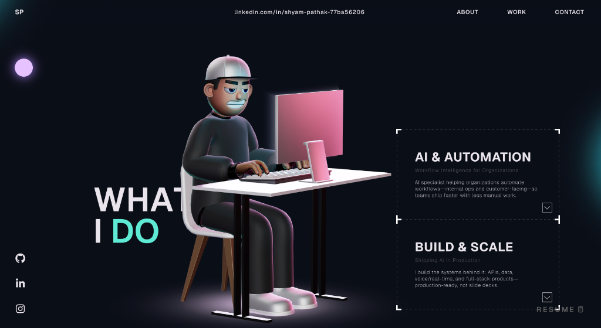

<div align="center">
  
  <h1 align="center">C Y B E R &nbsp; P O R T F O L I O</h1>
  <p align="center">
    <strong>A next-generation, interactive 3D portfolio built for the future.</strong>
  </p>
  <br />
  
</div>

---

## 🌌 Overview

Welcome to my digital cyberspace. This repository houses an immersive 3D portfolio designed to break the boundaries of conventional web experiences. Featuring a fully rigged, interactive 3D avatar, cinematic scroll transitions, and highly optimized rendering, this platform showcases my work in AI, Computer Vision, and full-stack engineering through a futuristic, glassmorphic lens.

## ⚡ Key Features

- **Interactive 3D Avatar:** A dynamic 3D character that tracks mouse movements and seamlessly transitions between environments as you scroll down the page.
- **Encrypted Model Handling:** To protect proprietary assets, all 3D models (`.glb`/`.gltf`) are encrypted into `.enc` format and decrypted on the fly in the client browser.
- **Draco Compression Pipeline:** Heavy geometry is radically reduced using Google's Draco compression via `DRACOLoader`, ensuring lightning-fast load times without sacrificing visual fidelity.
- **Cinematic Scroll Animations:** Powered by GSAP `ScrollTrigger` and Three.js cameras, navigating the site feels like directing a sci-fi movie.
- **Glassmorphism UI:** Neon glows, dark-mode aesthetics, and 3D floating panels create a beautiful and engaging user interface.

## 🛠 Tech Stack

Built with cutting-edge web technologies designed for performance and scale:

| Core Technology | Description |
| :--- | :--- |
|  | Component-based UI architecture |
|  | Strictly typed, robust application logic (TSX) |
|  | Native WebGL rendering engine |
|  | Blazing fast HMR and optimized production build |
|  | Advanced responsive layout & 3D styling |
|  | High-performance timeline and scroll animations |

## 🔐 Custom Asset Decryption

One of the unique technical challenges of this project was securing the 3D assets from unauthorized downloads.

```typescript
// Example Implementation
const encryptedBlob = await decryptFile("/models/character.enc", "SECRET_KEY");
const blobUrl = URL.createObjectURL(new Blob([encryptedBlob]));

loader.load(blobUrl, (gltf) => {
    // Inject decrypted Draco-compressed model directly into the Three.js scene
});
```
This custom pipeline ensures that `.enc` files remain secure on the server while maintaining a fast, native-feeling load process through memory blobs.

## 🚀 Getting Started

To run this instance locally on your machine:

1. **Clone the repository**
   ```bash
   git clone https://github.com/SHYam1025/3D-portfolio.git
   ```
2. **Install dependencies**
   ```bash
   npm install
   ```
3. **Launch the dev server**
   ```bash
   npm run dev
   ```

*Enter the grid and explore.*
